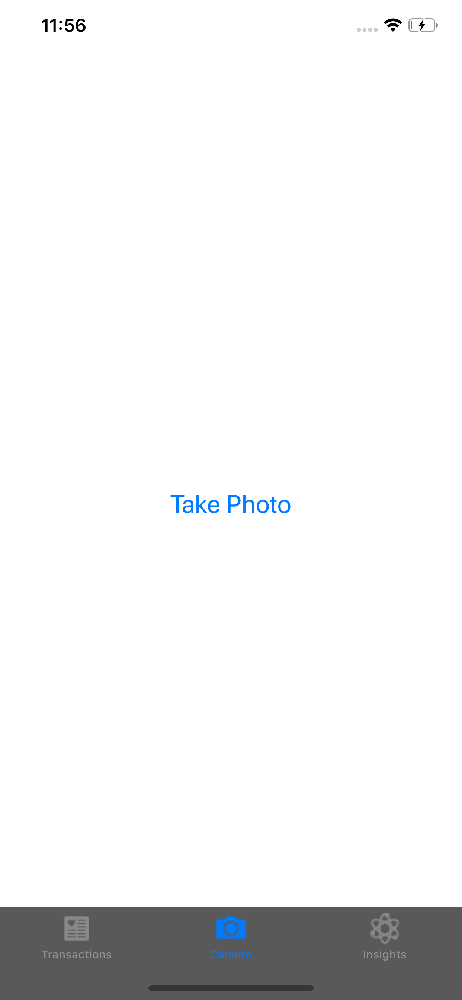
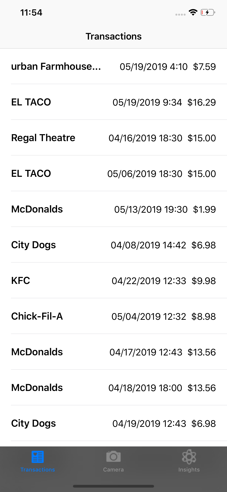
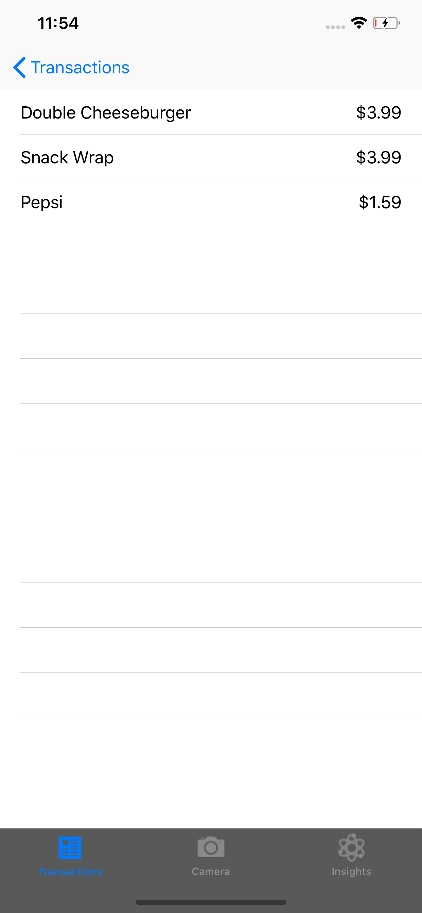
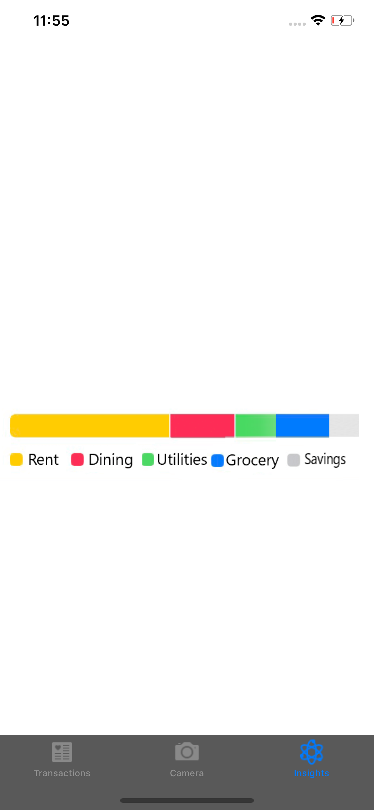
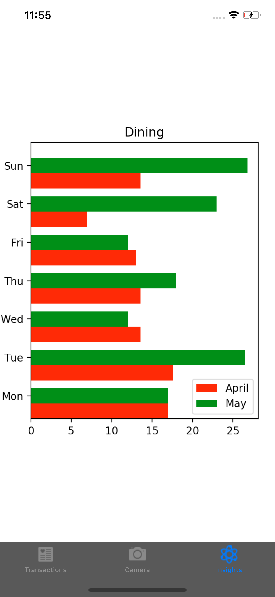
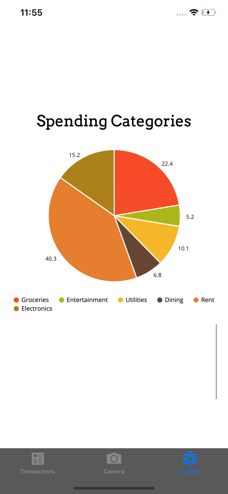

# Rackr
A receipt scanning, tracking, and analyzing app created for the 2019 Capital One Software Engineering Summit hackathon, winning 1st place.

Team members:
Jonathan Cai, Son Dinh, Reza Madhavan, Brandon Yuan

Scan a receipt:

Track your receipts:

Analyze your personal expenses:

