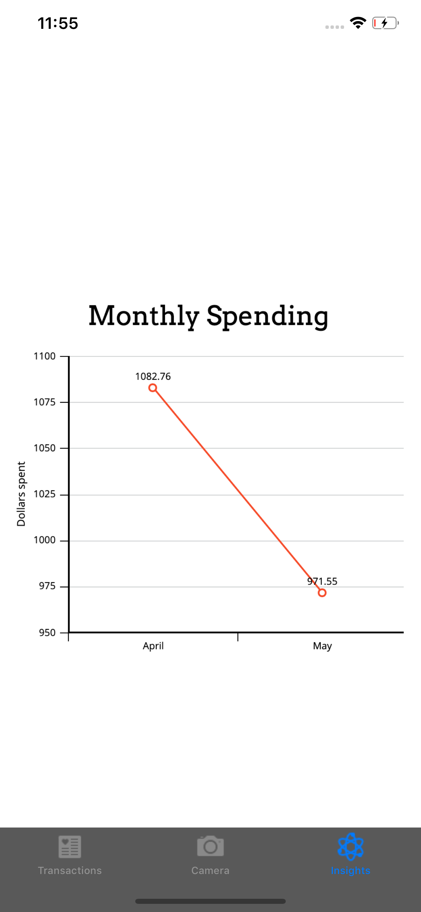

# Rackr
A receipt scanning, tracking, and analyzing app created for the 2019 Capital One Software Engineering Summit hackathon, winning 1st place.

Frontend iOS app built using Swift. Backend built with Flask framework, Google Vision API, ngrok for network tunneling.

Team members:
Jonathan Cai, Son Dinh, Reza Madhavan, Brandon Yuan

Scan a receipt:

Track your receipts:

Analyze your personal expenses:

